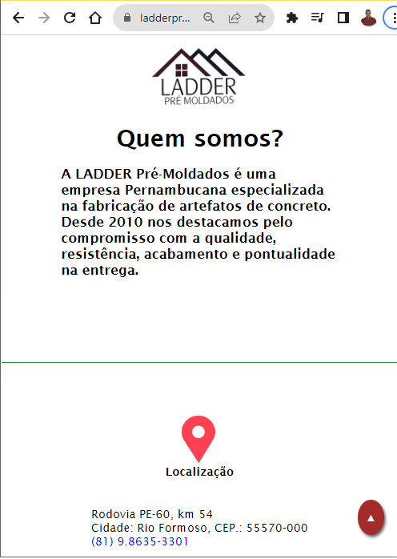
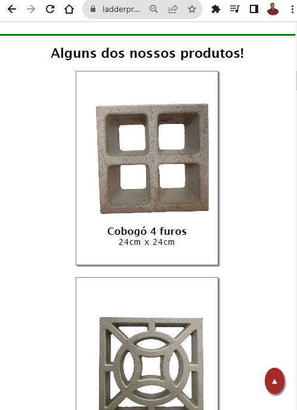
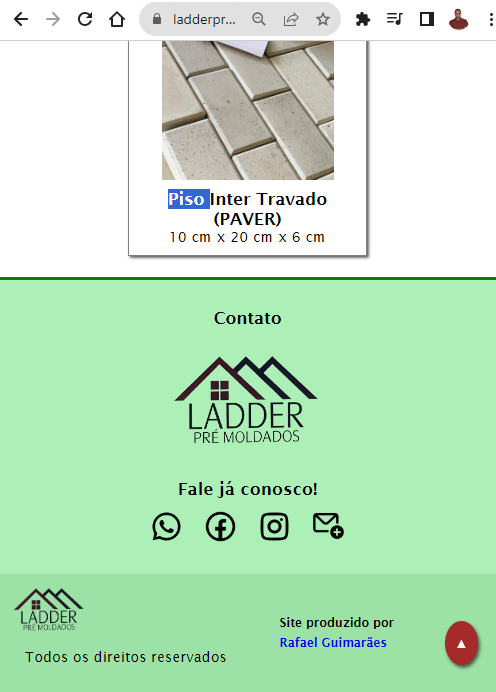

  
  <h1 align="center">
    Olá Tudo bem? Eu sou o <strong> Rafael Guimarães </strong>  😃️
  </h1>
  <h2> Graduações:</h2>
  <h2> 1. Graduado em Matemática</h2>
  <h2> 2. Tecnólogo em Análise e Desenvolvimento de Sistemas </h2>
  <h2> 3. Cursando Licenciatura da Ciência da Computação </h2>
  <h2> 4. Cursando Tecnólogo em Segurança da Informação </h2>
  <h2> ------------------------------------------------ </h2>
  <h2> Apaixonado pela área de TI em geral, Focado em CIBERSEGURANÇA! </h2>
 

<h3>:atom: Competências Técnicas: </h3>

- 💻 &nbsp; <strong> Projetos no ar em: HTML + CSS + JavaScript </strong>
- 🌐 &nbsp; <strong>( WebDesigner, SEO, FrontEnd )</strong>
- 🌐 &nbsp; <strong>( BackEnd com Python e NodeJS )</strong>
- 🔧 &nbsp; <strong>( VSCODE, GIT, GITHUB )</strong>

 
  
  
  
  
  
  
  
  
  
 

 

 
   
  

 

  

  
  

  
Feito com :heart: e HTML + CSS.

 

<h2>EXPERIÊNCIA PROFISSIONAL</h2>

Fui contratado para criar o site e gerenciar o SEO da empresa Ladder Pré-moldados, situada em Rio Formoso - PE.  
  <a href="https://ladderpremoldados.com.br/" target="_blank"> ladderpremoldados.com.br </a>
   
  <h3>PRINTS DA PÁGINA</h3>
  
 

  
 

  
  

  
  

  <h4>Resultado da pesquisa GOOGLE</h4>
🥇 1º Site na pesquisa, até na frente do perfil do Instagram
  
   

  
  

  

